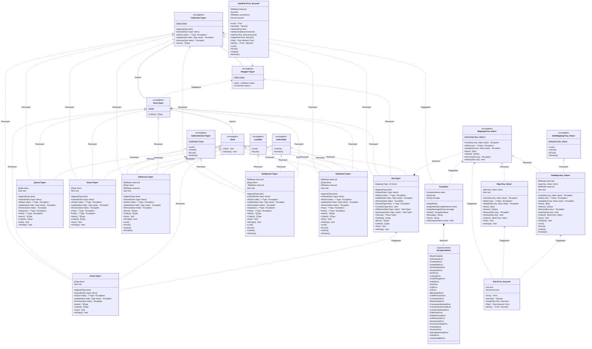

# Диаграммы
## Скопления

```mermaid
classDiagram
class Collection~Type~ {
    <<интерфейс>>
    +Append(Type Item)*
    +Extend(View~Type~ items)*
    +At(Size index) ~*Type, *Exception~*
    +Update(Size index, Type value) *Exception*
    +Remove(Size index) *Exception*
    +Items() *[]Type*
    +View~Type~$
}

class Mapping~Key, Value~ {
    <<интерфейс>>
    +Insert(Key key, Value value) *Exception*
    +At(Key key) ~*Value, *Exception~*
    +Update(Key key, Value value) *Exception*
    +Keys() []Key*
    +Values() []Value*
    +Remove(Key key) *Exception*
    +HasKey(Key key) bool*
    +View~Pair~Key, Value~~$
}

class SafeCollection~Type~ {
    <<интерфейс>>
    +Lock()*
    +Unlock()*
    +RLock()*
    +RUnlock()*
    +Collection~Type~$
}

class SafeMapping~Key, Value~ {
    <<интерфейс>>
    +Lock()*
    +Unlock()*
    +RLock()*
    +RUnlock()*
    +Mapping~Key, Value~$
}

class Lockable {
    <<интерфейс>>
    +Lock()
    +RLock()
}

class Unlockable {
    <<интерфейс>>
    +Unlock()
    +RUnlock()
}

class View~Type~ {
    <<интерфейс>>
    +Collect() []Type*
    +Sized$
}

class Wrapper~Type~ {
    <<интерфейс>>
    +Into() Collection~Type~*
    +From(View~Type~)*
    +View~Type~$
}

class Sized {
    <<интерфейс>>
    +Size() Size*
    +IsEmpty() bool*
}

class Exception {
    -ExceptionName name
    -String repr
    -String message
    -assignRepr()
    -assignName(ExceptionName name)
    -assignMessage(String message)
    +Name() ExceptionName
    +Message() String
    +Error() String
    +Is(ExceptionName name) bool
}

class ExceptionName {
    <<перечисление>>
    +BaseException
    +ArithmeticError
    +OverflowError
    +UnderflowError
    +ZeroDivisionError
    +AssertionError
    +EOFError
    +LookupError
    +OutOfRangeError
    +IndexError
    +KeyError
    +OSError
    +IOError
    +BlockingIOError
    +ChildProcessError
    +ConnectionError
    +BrokenPipeError
    +ConnectionAbortedError
    +ConnectionRefusedError
    +ConnectionResetError
    +FileExistsError
    +FileNotFoundError
    +IsADirectoryError
    +PermissionError
    +ProcessLookupError
    +TimeoutError
    +RuntimeError
    +NotImplementedError
    +ValueError
    +UnreachableError
}

class Pair~First, Second~ {
    -First first
    -Second second
    +First() *First
    +Second() *Second
    +Swap(Pair~First, Second~)
    +Flip() *Pair~Second, First~
    +Items() ~*First, *Second~
}

class SafePair~First, Second~ {
    -RWMutex firstLock
    -First first
    -RWMutex secondLock
    -Second second
    +First() *First
    +Second() *Second
    +SetFirst(First first)
    +SetSecond(Second second)
    +Set(First first, Second second)
    +Swap(Pair~First, Second~)
    +Flip() *Pair~Second, First~
    +Items() ~*First, *Second~
    +Lock()
    +RLock()
    +Unlock()
    +RUnlock()
}

class Array~Type~ {
    -[]Type items
    -Size size
    +Append(Type Item)
    +Extend(View~Type~ items)
    +At(Size index) ~*Type, *Exception~
    +Update(Size index, Type value) *Exception
    +Remove(Size index) *Exception
    +Items() *[]Type
    +Collect() []Type
    +Size() Size
    +IsEmpty() bool
}

class Map~Key, Value~ {
    -map~Key, Value~ items
    -Size size
    +Insert(Key key, Value value) *Exception
    +At(Key key) ~*Value, *Exception~
    +Update(Key key, Value value) *Exception
    +Keys() []Key
    +Values() []Value
    +Remove(Key key) *Exception
    +HasKey(Key key) bool
    +Collect() []Pair~Key, Value~
    +Size() Size
    +IsEmpty() bool
}

class Queue~Type~ {
    -[]Type items
    -Size size
    +Append(Type Item)
    +Extend(View~Type~ items)
    +At(Size index) ~*Type, *Exception~
    +Update(Size index, Type value) *Exception
    +Remove(Size index) *Exception
    +Dequeue() ~*Type, *Exception~
    +Peek() ~*Type, *Exception~
    +Items() *[]Type
    +Collect() []Type
    +Size() Size
    +IsEmpty() bool
}

class Stack~Type~ {
    -[]Type items
    -Size size
    +Append(Type Item)
    +Extend(View~Type~ items)
    +At(Size index) ~*Type, *Exception~
    +Update(Size index, Type value) *Exception
    +Remove(Size index) *Exception
    +Pop() ~*Type, *Exception~
    *Peek() ~*Type, *Exception~
    +Items() *[]Type
    +Collect() []Type
    +Size() Size
    +IsEmpty() bool
}

class SafeArray~Type~ {
    -RWMutex itemLock
    -[]Type items
    -RWMutex sizeLock
    -Size size
    +Append(Type Item)
    +Extend(View~Type~ items)
    +At(Size index) ~*Type, *Exception~
    +Update(Size index, Type value) *Exception
    +Remove(Size index) *Exception
    +Items() *[]Type
    +Collect() []Type
    +Size() Size
    +IsEmpty() bool
    +Lock()
    +RLock()
    +Unlock()
    +RUnlock()
}

class SafeMap~Key, Value~ {
    -RWMutex itemLock
    -map~Key, Value~ items
    -RWMutex sizeLock
    -Size size
    +Insert(Key key, Value value) *Exception
    +At(Key key) ~*Value, *Exception~
    +Update(Key key, Value value) *Exception
    +Keys() []Key
    +Values() []Value
    +Remove(Key key) *Exception
    +HasKey(Key key) bool
    +Collect() []Pair~Key, Value~
    +Size() Size
    +IsEmpty() bool
    +Lock()
    +RLock()
    +Unlock()
    +RUnlock()
}

class SafeQueue~Type~ {
    -RWMutex itemLock
    -[]Type items
    - RWMutex sizeLock
    -Size size
    +Append(Type Item)
    +Extend(View~Type~ items)
    +At(Size index) ~*Type, *Exception~
    +Update(Size index, Type value) *Exception
    +Remove(Size index) *Exception
    +Dequeue() ~*Type, *Exception~
    +Peek() ~*Type, *Exception~
    +Items() *[]Type
    +Collect() []Type
    +Size() Size
    +IsEmpty() bool
    +Lock()
    +RLock()
    +Unlock()
    +RUnlock()
}

class SafeStack~Type~ {
    -RWMutex itemLock
    -[]Type items
    -RWMutex sizeLock
    -Size size
    +Append(Type Item)
    +Extend(View~Type~ items)
    +At(Size index) ~*Type, *Exception~
    +Update(Size index, Type value) *Exception
    +Remove(Size index) *Exception
    +Pop() ~*Type, *Exception~
    *Peek() ~*Type, *Exception~
    +Items() *[]Type
    +Collect() []Type
    +Size() Size
    +IsEmpty() bool
    +Lock()
    +RLock()
    +Unlock()
    +RUnlock()
}

class Set~Type~ {
    -Mapping~Type, nil~ items
    +Append(Type Item)
    +Extend(View~Type~ items)
    +At(Size index) ~*Type, *Exception~
    +Update(Size index, Type value) *Exception
    +Remove(Size index) *Exception
    +Discard(Type item) ~*Type, *Exception~
    +Contains(Type item) bool
    +Difference(Set~Type~ other) *Set~Type~
    +Intersection(Set~Type~ other) *Set~Type~
    +ToArray() *Array~Type~
    +ToString() String
    +Items() *[]Type
    +Collect() []Type
    +Size() Size
    +IsEmpty() bool
}

Collection o-- View : Агрегат
Collection o-- Wrapper : Агрегат
View o-- Sized : Агрегат

Collection <|.. Array : Реализует
Collection <|.. Queue : Реализует
Collection <|.. Stack : Реализует
Collection <|.. Set : Реализует
Collection <|.. SafeArray : Реализует
Collection <|.. SafeQueue : Реализует
Collection <|.. SafeStack : Реализует

SafeCollection <|.. SafeArray : Реализует
SafeCollection <|.. SafeQueue : Реализует
SafeCollection <|.. SafeStack : Реализует

Lockable <|.. SafeArray : Реализует
Lockable <|.. SafeQueue : Реализует
Lockable <|.. SafeStack : Реализует

Unlockable <|.. SafeArray : Реализует
Unlockable <|.. SafeQueue : Реализует
Unlockable <|.. SafeStack : Реализует

View <|.. Array : Реализует
View <|.. Queue : Реализует
View <|.. Stack : Реализует
View <|.. Set : Реализует
View <|.. SafeArray : Реализует
View <|.. SafeQueue : Реализует
View <|.. SafeStack : Реализует

Wrapper <|.. Set : Реализует
Wrapper <.. View : Поддержка
Wrapper <.. Collection : Поддержка

Sized <|.. Array : Реализует
Sized <|.. Queue : Реализует
Sized <|.. Stack : Реализует
Sized <|.. Set : Реализует
Sized <|.. SafeArray : Реализует
Sized <|.. SafeQueue : Реализует
Sized <|.. SafeStack : Реализует

Mapping <|.. Map : Реализует
Mapping <|.. SafeMap : Реализует
SafeMapping <|.. SafeMap : Реализует
Mapping ..* Set : Композит
Mapping <.. Pair : Поддержка
Map <.. Pair : Поддержка
SafeMap <.. Pair : Поддержка

Set <.. Array : Поддержка

Collection <.. Exception : Поддержка
Mapping <.. Exception : Поддержка

Exception *-- ExceptionName : Композит
```